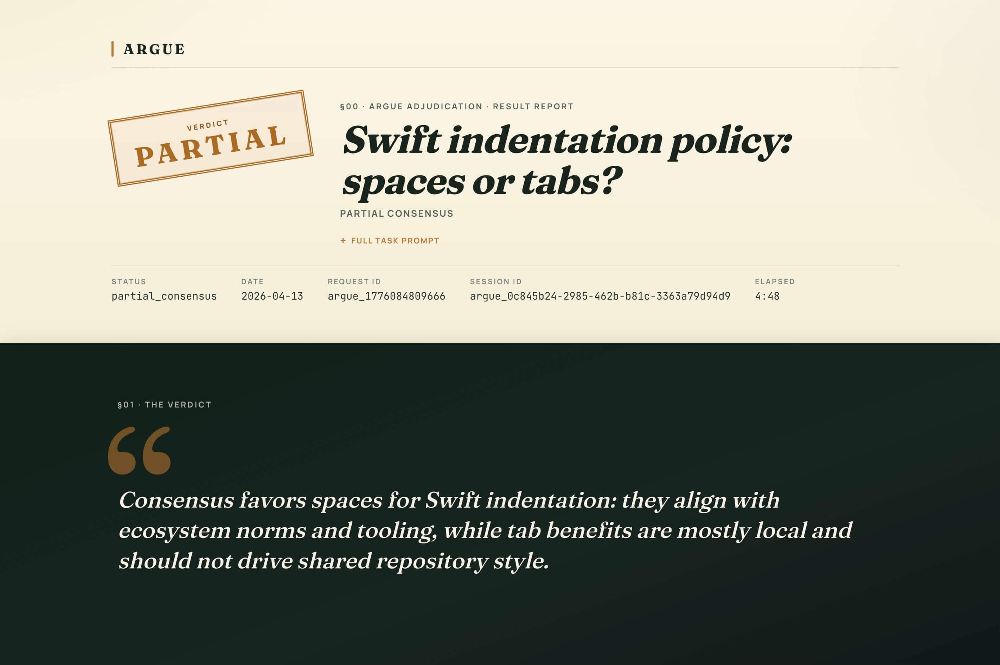

# argue

**[English](README.md) | [中文](README_CN.md)**

> _夫れ事は独り断ずべからず、必ず衆と論ずべし。_ —— 聖徳太子『十七条憲法』第十七条

argue は構造化されたマルチエージェント討論エンジンです。複数の AI エージェントが同じ問題を独立に分析し、ラウンドを超えて互いの主張を検証し合い、投票によって合意を形成します——単一エージェントでは到達できない品質の結果を生み出します。

問いを与えれば、クロスレビューを経た主張、合意度を定量化した投票結果、そしてピアレビュースコアリングに裏付けされた代表レポートが返されます。ハルシネーションが減り、厳密さが増します。

## ライブデモ

[](https://argue.onev.cat/example)

**[https://argue.onev.cat/example](https://argue.onev.cat/example)** —— 実際の argue 実行結果を、公式 viewer でレンダリングしたものです。argue が何を生み出すのか、ブラウザで開けば一目で分かります：

- **公開の場で議論するエージェント。** すべての主張・ピアジャッジ・マージ・投票が、ラウンド単位で完全に記録されます。
- **洗練されたドシエ。** 最高スコアのエージェントが執筆し、そのまま読める・共有できる・PR に貼れる形で届きます。
- **生データはすべてディスクに保存。** viewer をレンダリングしているのと同じ JSON が手元に残り、レビュー bot・コード生成・監査ログなど、下流のあらゆる工程に渡せます。

## argue スキルをインストール

スキル対応のコーディングエージェント（Claude Code、Codex など）を使っているなら、セットアップごとエージェントに任せてしまえます。argue は [agent skill](https://skills.sh/) として公開されており、いつ argue を使うか、CLI のインストール・設定方法、推奨デフォルト、討論の実行方法まで一式をエージェントに教え込みます。

```bash
npx skills add https://github.com/onevcat/argue --skill argue
```

インストール後は「X について argue で議論して」「セカンドオピニオンが欲しい」とエージェントに伝えるだけです。初回利用時に CLI をセットアップし（グローバルインストール前に必ず確認を取ります）、討論・レポート・後続アクションまで一気通貫で進めてくれます。

## クイックスタート

石斧片手の「原始人」よろしく自分で CLI を叩きたい派？どうぞご自由に——下記が手動ルートです。

### インストール

```bash
npm install -g @onevcat/argue-cli
```

### 設定

```bash
# 設定ファイルを作成 (~/.config/argue/config.json)
argue config init

# プロバイダーとエージェントを追加
argue config add-provider --id claude --type cli --cli-type claude --model-id sonnet --agent claude-agent
argue config add-provider --id codex --type cli --cli-type codex --model-id gpt-5.3-codex --agent codex-agent
```

### 討論を開始

```bash
argue run --task "マイクロサービスにはモノレポとポリレポのどちらを採用すべきか？"
```

`--verbose` をつけると、各エージェントの推論過程・主張・判断がリアルタイムで確認できます。

エージェントに結果を**実行**させるには `--action` を追加：

```bash
argue run \
  --task "この issue を調査して解決策を検討：https://github.com/onevcat/argue/issues/22" \
  --action "合意に基づいて issue を修正し、PR を作成" \
  --verbose
```

### 実行結果

```
[argue] run started
  task: 研究这个 issue 的解法：https://github.com/onevcat/argue/issues/22
  agents: claude-agent, codex-agent | rounds: 2..3

[argue] initial#0  codex-agent (claims+6) — ESLint+Prettier setup, CI lint gate
[argue] initial#0  claude-agent (claims+6) — runtime bugs (couldn't access the issue URL)

[argue] debate#1   codex-agent (1✗ 5↻) — claude's claims valid but out-of-scope
[argue] debate#1   claude-agent (5✗ 1↻) — agreed, self-corrected
[argue] debate#1   claim merged c6 -> c2
  ... 2 more rounds, agents refine and converge ...

[argue] final_vote  11/11 claims accepted unanimously
[argue] result: consensus — codex-agent representative (83.70)
[argue] action: codex-agent opened PR #28
```

codex-agent は issue にアクセスし ESLint/Prettier の主張を提出。claude-agent はネットワーク制限で URL にアクセスできず、ランタイムバグを発見。討論で codex-agent がスコープ外と指摘し、claude-agent が自己修正、両者が収束。全 11 件の主張が全会一致で可決され、代表エージェントが合意を[実際の PR](https://github.com/onevcat/argue/pull/28) に変換しました。

各実行後、argue は 3 つの出力ファイルを `~/.argue/output/<requestId>/`（グローバル設定）または `./out/<requestId>/`（ローカル設定）に書き出します：

| ファイル       | 内容                                                                         |
| -------------- | ---------------------------------------------------------------------------- |
| `events.jsonl` | ストリーミングイベントログ——dispatch、応答、統合、投票、スコアリングの全記録 |
| `result.json`  | 構造化された結果——ステータス、主張、決議、スコア、代表、アクション           |
| `summary.md`   | 代表エージェントが作成した人間が読めるレポート                               |

[この実行の完全な出力を確認する。](https://gist.github.com/onevcat/bbf42778888180c443bea78f395f255b)

### レポートを表示

実行が完了するたびに、argue はレポートをホストされた viewer で開く方法を示すヒントを出力します：

```
→ View report: argue view argue_1712345678901_a3f9c2
```

最近の実行を直接開くこともできます：

```bash
argue view                  # 最新の実行を開く
argue view <request-id>     # 指定した実行を開く
argue run --view            # 実行完了後に自動で開く
```

レポートは gzip 圧縮後に base64url で URL フラグメントにエンコードされ、デコードはすべてブラウザ側で行われます——**サーバーには何もアップロードされません**。デフォルトの viewer は `https://argue.onev.cat/` でホストされています。別の viewer を指定するには（ローカル viewer 開発など）、config に `viewer.url` を設定するか `--viewer-url https://your-viewer/` を渡してください。

### よく使うオプション

複雑なタスクや繰り返し実行する場合は、インラインフラグの代わりに [input JSON ファイル](https://github.com/onevcat/argue/blob/master/packages/argue-cli/examples/task.example.json)を使用できます：

```bash
argue run --input task.json
```

便利なフラグ：

```bash
--agents a1,a2          # 設定から特定のエージェントを選択
--min-rounds 2          # 早期終了前に最低 2 ラウンドの討論
--max-rounds 5          # 討論ラウンドの上限
--threshold 0.67        # 合意閾値（デフォルト: 1.0 = 全会一致）
--action "修正して"      # 討論後に代表が実行するアクション
--verbose               # 各エージェントの推論をリアルタイム表示
```

`argue --help` で全オプションを確認できます。

## ライブラリとして使用

argue-cli の裏側にあるのは `@onevcat/argue`、任意のシステムに組み込める独立した討論エンジンです。`AgentTaskDelegate` という 1 つのインターフェースを実装するだけで、argue エンジンがすべてのオーケストレーションを処理します。

### インストール

```bash
npm install @onevcat/argue
```

### Delegate の実装

```ts
import type { AgentTaskDelegate } from "@onevcat/argue";

const delegate: AgentTaskDelegate = {
  async dispatch(task) {
    // タスクを発行し、taskId を即座に返す。エンジンは全参加者を
    // 並列に dispatch してから個別に結果を await するため、
    // ここで長時間ブロックせず速やかに返すこと。
    const taskId = await myAgentFramework.submit(task);
    return { taskId, participantId: task.participantId, kind: task.kind };
  },

  async awaitResult(taskId, timeoutMs) {
    // taskId ごとに結果を収集。エンジンはこれを使ってタイムアウト、
    // 排除、段階的な結果確定を管理する。
    const result = await myAgentFramework.waitFor(taskId, timeoutMs);
    return { ok: true, output: result };
  }
};
```

### エンジンの実行

```ts
import { ArgueEngine, MemorySessionStore, DefaultWaitCoordinator } from "@onevcat/argue";

const engine = new ArgueEngine({
  taskDelegate: delegate,
  sessionStore: new MemorySessionStore(),
  waitCoordinator: new DefaultWaitCoordinator(delegate)
});

const result = await engine.start({
  requestId: "review-42",
  task: "PR #42 のセキュリティと正確性の問題をレビュー",
  participants: [
    { id: "security-agent", role: "security-reviewer" },
    { id: "arch-agent", role: "architecture-reviewer" },
    { id: "correctness-agent", role: "correctness-reviewer" }
  ],
  roundPolicy: { minRounds: 2, maxRounds: 4 },
  consensusPolicy: { threshold: 0.67 },
  reportPolicy: { composer: "representative" },
  actionPolicy: {
    prompt: "発見されたすべての問題を修正し、サマリーコメントを投稿。"
  }
});

// result.status → "consensus" | "partial_consensus" | "unresolved"
// result.claimResolutions → 主張ごとの投票結果
// result.representative → 最高スコアのエージェント
// result.action → アクション出力（actionPolicy が設定されている場合）
```

### 統合例：Claude Code Hook

hook を通じて argue を既存ツールに接続できます。例えば、[Claude Code hook](https://docs.anthropic.com/en/docs/claude-code/hooks) として、コミット前にマルチエージェントレビューをトリガー：

```jsonc
// .claude/settings.json
{
  "hooks": {
    "PreToolUse": [
      {
        "matcher": "Bash",
        "hooks": [
          {
            "type": "command",
            "command": "node ./hooks/argue-review.mjs \"$TASK_INPUT\""
          }
        ]
      }
    ]
  }
}
```

```ts
// hooks/argue-review.mjs
import { ArgueEngine, MemorySessionStore, DefaultWaitCoordinator } from "@onevcat/argue";
import { createDelegate } from "./my-delegate.mjs";

const input = JSON.parse(process.argv[2]);
if (!input.command?.includes("git commit")) process.exit(0);

const delegate = createDelegate();
const engine = new ArgueEngine({
  taskDelegate: delegate,
  sessionStore: new MemorySessionStore(),
  waitCoordinator: new DefaultWaitCoordinator(delegate)
});

const result = await engine.start({
  requestId: `pre-commit-${Date.now()}`,
  task: "ステージされた変更をバグ、セキュリティ問題、スタイル違反の観点でレビュー",
  participants: [
    { id: "security", role: "security-reviewer" },
    { id: "quality", role: "code-quality-reviewer" }
  ],
  roundPolicy: { minRounds: 1, maxRounds: 2 },
  consensusPolicy: { threshold: 1.0 }
});

if (result.status !== "consensus") {
  console.error("レビューが合意に達しませんでした。コミットをブロックします。");
  process.exit(1);
}
```

## 仕組み

### 討論フロー

```
+------+                      +--------+                           +---------+         +---------+
| Host |                      | Engine |                           | Agent A |         | Agent B |
+------+                      +--------+                           +---------+         +---------+
    |                              |                                    |                   |
    |  start(task, participants)   |                                    |                   |
    |------------------------------>                                    |                   |
    |                              |                                    |                   |
    |                              |                 +-------------------+                  |
    |                              |                 | Round 0 - Initial |                  |
    |                              |                 +-------------------+                  |
    |                              |                                    |                   |
    |                              |         dispatch(initial)          |                   |
    |                              |------------------------------------>                   |
    |                              |                   dispatch(initial)|                   |
    |                              |-------------------------------------------------------->
    |                              |              claims                |                   |
    |                              <....................................|                   |
    |                              |                        claims      |                   |
    |                              <........................................................|
    |                              |                                    |                   |
    |                              |                +---------------------+                 |
    |                              |                | Round 1..N - Debate |                 |
    |                              |                +---------------------+                 |
    |                              |                                    |                   |
    |                              |  dispatch(debate + peer context)   |                   |
    |                              |------------------------------------>                   |
    |                              |            dispatch(debate + peer context)             |
    |                              |-------------------------------------------------------->
    |                              |        judgements, merges          |                   |
    |                              <....................................|                   |
    |                              |                  judgements, merges|                   |
    |                              <........................................................|
    |                              |                                    |                   |
    |                       +-------------+                             |                   |
    |                       | early-stop? |                             |                   |
    |                       +-------------+                             |                   |
    |                              |                                    |                   |
    |                              |              +------------------------+                |
    |                              |              | Round N+1 - Final Vote |                |
    |                              |              +------------------------+                |
    |                              |                                    |                   |
    |                              |       dispatch(final_vote)         |                   |
    |                              |------------------------------------>                   |
    |                              |                 dispatch(final_vote)                   |
    |                              |-------------------------------------------------------->
    |                              |      accept/reject per claim       |                   |
    |                              <....................................|                   |
    |                              |                accept/reject per claim                 |
    |                              <........................................................|
    |                              |                                    |                   |
    |                   +---------------------+                         |                   |
    |                   | consensus + scoring |                         |                   |
    |                   +---------------------+                         |                   |
    |                              |                                    |                   |
    |                              |         dispatch(report)           |                   |
    |                              |------------------------------------>                   |
    |                              |       representative report        |                   |
    |                              <....................................|                   |
    |                              |                                    |                   |
    |         ArgueResult          |                                    |                   |
    <..............................|                                    |                   |
    |                              |                                    |                   |
+------+                      +--------+                           +---------+         +---------+
| Host |                      | Engine |                           | Agent A |         | Agent B |
+------+                      +--------+                           +---------+         +---------+
```

### 各フェーズのルール

| フェーズ                  | エージェントの動作                                          | エンジンの動作                               |
| ------------------------- | ----------------------------------------------------------- | -------------------------------------------- |
| **Initial**（ラウンド 0） | 主張を提出、既存の主張を評価                                | すべての主張を共有プールに集約               |
| **Debate**（1..N）        | 他者の主張を評価（`agree`/`disagree`/`revise`）、統合を提案 | 重複を統合、立場の変化を追跡、早期終了を判定 |
| **Final Vote**（N+1）     | 各アクティブな主張に `accept`/`reject` で投票               | 主張ごとの合意率を閾値と比較                 |

### 主要メカニズム

- **主張のライフサイクル**：各主張のステータスは `active`、`merged`、`withdrawn`。統合された主張は提案者を存続する主張に引き継ぎます。
- **早期終了**：すべての判断が一致し新しい主張が出なければ、`minRounds` 到達後に討論を早期終了——無駄なラウンドを削減。
- **排除**：タイムアウトまたはエラーのエージェントは永久に除外。合意計算の分母は自動調整されます。
- **スコアリング**：正確性（35%）、網羅性（25%）、実行可能性（25%）、一貫性（15%）の4軸でピアレビュー評価。
- **代表**：最高スコアのエージェントが最終レポートを作成。失敗時は内蔵サマリーにフォールバック。
- **アクション**：オプションで、代表（または指定エージェント）が合意に基づいて実際の操作を実行。

### プロバイダータイプ

CLI はエージェント接続用に 4 つのプロバイダータイプをサポート：

| タイプ | 用途                                               | 例                                                 |
| ------ | -------------------------------------------------- | -------------------------------------------------- |
| `cli`  | CLI インターフェースを持つコーディングエージェント | Claude Code, Codex CLI, Copilot CLI, Gemini CLI    |
| `api`  | モデル API への直接アクセス                        | OpenAI, Anthropic, Ollama, OpenAI 互換 API         |
| `sdk`  | エージェントフレームワーク用カスタムアダプター     | 独自の SDK 統合                                    |
| `mock` | テストと開発                                       | 決定的なレスポンス、タイムアウトのシミュレーション |

## 設定リファレンス

完全な設定例：[`packages/argue-cli/examples/config.example.json`](packages/argue-cli/examples/config.example.json)

`reasoning` は、プロバイダーモデル設定とエージェント設定の両方で指定できる任意文字列です：

- `providers.<id>.models.<modelId>.reasoning`：モデル側のデフォルト値
- `agents[].reasoning`：エージェント単位の上書き

`reasoning` の受け渡しは best-effort で、プロバイダー種別と実行経路に依存します：

- `cli` providers：
  - `claude` → `--effort <reasoning>`
  - `codex` → `-c model_reasoning_effort=<reasoning>`
  - `generic` → stdin envelope の `agent.reasoning` として渡される
  - その他の `cliType` → no-op（runner ごとに1回だけ警告）
- `api` providers：現時点では no-op（設定は受理されるが、まだ下流へは転送されない）

ユーザー責任：

- `argue` はこの文字列を保持/転送するだけで、provider ごとの受理値検証は行いません。
- 下流モデル/ツール能力との互換性確認はユーザー側の責任です。
- provider が値を拒否した場合、エラーは下流 runtime/API から表面化します。

設定ファイルの検索順序：

1. `--config <path>` フラグ
2. `./argue.config.json`（ローカル）
3. `~/.config/argue/config.json`（グローバル）

CLI フラグ > input JSON > 設定デフォルト値。

## 開発

```bash
npm install
npm run dev              # watch モード
npm run ci               # 型チェック + テスト + ビルド
npm run release:check    # tarball スモークテスト付き
```

## License

MIT
