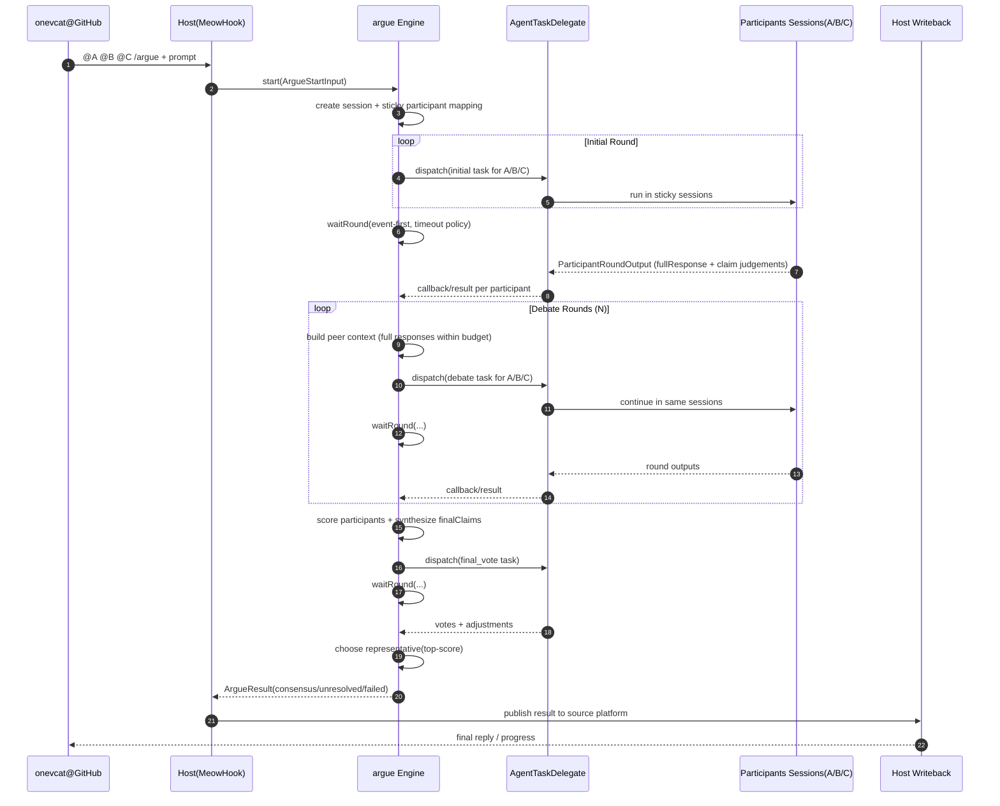

# argue 时序图（宿主以 GitHub + MeowHook 为例）

> GitHub 支持 Mermaid 代码块直接渲染，可直接放在 issue / PR / README 中。

```mermaid
sequenceDiagram
    autonumber
    participant U as onevcat@GitHub
    participant H as Host(MeowHook)
    participant A as argue Engine
    participant D as AgentTaskDelegate
    participant C as Participants Sessions(A/B/C)
    participant R as Host Writeback

    U->>H: @A @B @C /argue + prompt
    H->>A: start(ArgueStartInput)
    A->>A: create session + sticky participant mapping

    loop Initial Round
      A->>D: dispatch(initial task for A/B/C)
      D->>C: run in sticky sessions
    end

    A->>A: waitRound(event-first, timeout policy)
    C-->>D: ParticipantRoundOutput (fullResponse + claim judgements)
    D-->>A: callback/result per participant

    loop Debate Rounds (N)
      A->>A: build peer context (full responses within budget)
      A->>D: dispatch(debate task for A/B/C)
      D->>C: continue in same sessions
      A->>A: waitRound(...)
      C-->>D: round outputs
      D-->>A: callback/result
    end

    A->>A: score participants + synthesize finalClaims
    A->>D: dispatch(final_vote task)
    A->>A: waitRound(...)
    D-->>A: votes + adjustments

    A->>A: choose representative(top-score)
    A-->>H: ArgueResult(consensus/unresolved/failed)
    H->>R: publish result to source platform
    R-->>U: final reply / progress
```
