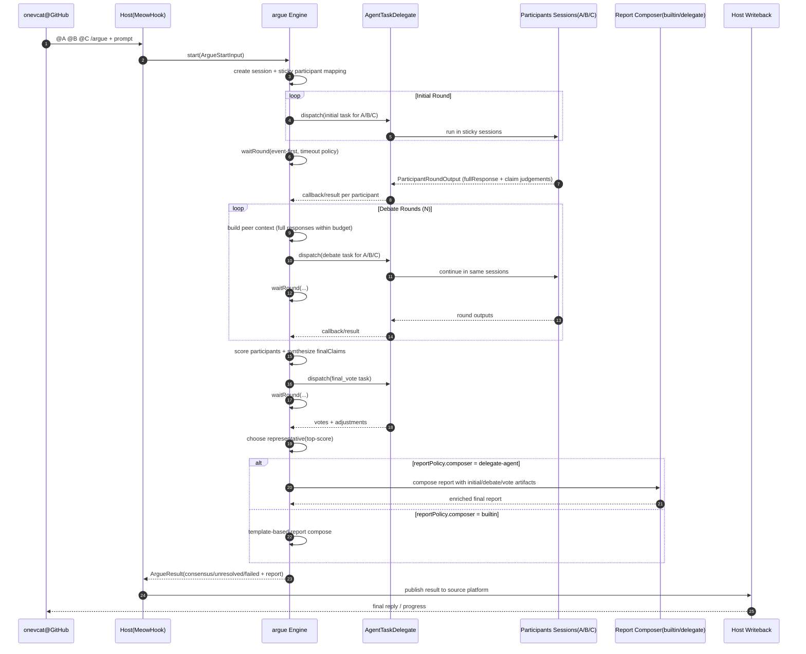

# argue v0 初期计划（单文档版）

> 本文件是 v0 唯一计划文档，包含流程、协议形状、等待机制与时序图。

## 0. 关键决策（当前版本）

1. 每个参与者默认固定同一会话（sticky-per-participant）。
2. 轮次输入优先传递他人上一轮**完整回答**（预算内，必要时截断）。
3. 输出采用 claim-level（逐论点）判断，而不是单条结论判断。
4. 引入评分系统，最终由最高分参与者代表发言。
5. 编排器负责等待机制（派发、等待、超时、补偿），不是宿主临时拼接。
6. 最终报告新增可选“过程揭露”模式；开启时建议走独立 reporter 会话生成。
7. “代表发言”与“报告生成方式（builtin/delegate-agent）”是两条独立维度。
8. 最低参与人数为 2（`minParticipants=2`）。

---

## 1. 目标与边界

### 目标

把“多 agent 并行产出 -> 多轮互评 -> 收敛共识 -> 代表发言 -> 可选过程揭露报告”做成可复用编排组件。

### 非目标（强约束）

`argue` 不负责：

1. 外部触发源接入（GitHub/IM/CLI 等）
2. 具体 agent 执行实现（OpenClaw hook / ACP / 本地 runtime）
3. 外部平台回写（GitHub 评论、消息发送等）

这些由宿主通过委托接口注入。

---

## 2. 核心流程（MVP）

1. **Start**：接收 `ArgueStartInput`，创建会话。
2. **Initial Round**：并行派发初始任务，收集完整回答。
3. **Debate Rounds**（默认 3 轮）：
   - 每个参与者在同一 sticky session 继续。
   - 带入他人上一轮完整回答（预算内）。
   - 输出 claim-level judgement（agree/disagree/revise）。
4. **Synthesis**：聚合成统一 `finalClaims`。
5. **Final Vote**：各参与者 `accept/reject` 并可附修正。
6. **Scoring**：按 rubric 计算分数。
7. **Representative**：按分数选出代表发言。
8. **Report Compose**：
   - 默认 `builtin`：结构化模板快速生成
   - 可选 `delegate-agent`：使用独立 reporter 会话，汇总初始/圆桌/投票全过程
9. **Finalize**：输出 `consensus / unresolved / failed`。

---

## 3. 协议形状

## 3.1 Start 输入：`ArgueStartInput`

```ts
export type ArgueStartInput = {
  requestId: string;
  topic: string;
  objective: string;

  participants: Array<{
    id: string;               // e.g. onevclaw
    role?: string;
  }>;

  participantsPolicy?: {
    minParticipants?: number; // default: 2, must be >= 2
  };

  roundPolicy?: {
    minRounds?: number;       // default: 2
    maxRounds?: number;       // default: 3
  };

  sessionPolicy?: {
    mode: "sticky-per-participant"; // v0 固定
    sessionKeyPrefix?: string;
  };

  peerContextPolicy?: {
    passMode: "full-response-preferred";
    maxCharsPerPeerResponse?: number; // default: 6000
    maxPeersPerRound?: number;        // default: all-others
    overflowStrategy?: "truncate-tail" | "truncate-middle";
  };

  scoringPolicy?: {
    enabled: true;
    representativeSelection: "top-score";
    tieBreaker: "latest-round-score" | "least-objection";
    rubric?: {
      correctness?: number;
      completeness?: number;
      actionability?: number;
      consistency?: number;
    };
  };

  reportPolicy?: {
    includeDeliberationTrace?: boolean;     // default: false
    traceLevel?: "compact" | "full";       // default: compact
    composer?: "builtin" | "delegate-agent"; // default: builtin
    reporterId?: string;                    // composer=delegate-agent 时可选
    maxReportChars?: number;
  };

  waitingPolicy?: {
    mode: "event-first" | "polling" | "hybrid";
    perTaskTimeoutMs?: number;      // default: 10m
    perRoundTimeoutMs?: number;     // default: 20m
    globalDeadlineMs?: number;
    lateArrivalPolicy?: "accept-if-before-finalize" | "drop";
  };

  constraints?: {
    language?: string;
    tokenBudgetHint?: number;
  };

  context?: Record<string, unknown>; // 平台无关透传
};
```

## 3.2 轮次任务输入：`RoundTaskInput`

```ts
export type RoundTaskInput = {
  sessionId: string;
  requestId: string;
  participantId: string;
  phase: "initial" | "debate" | "final_vote";
  round: number;

  prompt: string;

  selfHistoryRef?: {
    stickySession: true;
  };

  peerRoundInputs?: Array<{
    participantId: string;
    round: number;
    fullResponse: string;
    truncated?: boolean;
  }>;

  claimCatalog?: Claim[];
  metadata?: Record<string, unknown>;
};
```

## 3.3 论点与轮次输出

```ts
export type Claim = {
  claimId: string;
  title: string;
  statement: string;
  category?: "pro" | "con" | "risk" | "tradeoff" | "todo";
};

export type ClaimJudgement = {
  claimId: string;
  stance: "agree" | "disagree" | "revise";
  confidence: number; // 0~1
  rationale: string;
  revisedStatement?: string;
};

export type ParticipantRoundOutput = {
  participantId: string;
  phase: "initial" | "debate" | "final_vote";
  round: number;

  fullResponse: string;

  extractedClaims?: Claim[];
  judgements: ClaimJudgement[];

  selfScore?: number;
  vote?: "accept" | "reject";

  summary: string;
};
```

## 3.4 最终输出：`ArgueResult`

```ts
export type ParticipantScore = {
  participantId: string;
  total: number;
  byRound: Array<{ round: number; score: number }>;
  breakdown?: {
    correctness?: number;
    completeness?: number;
    actionability?: number;
    consistency?: number;
  };
};

export type OpinionShift = {
  claimId: string;
  participantId: string;
  from: "agree" | "disagree" | "revise" | "unknown";
  to: "agree" | "disagree" | "revise";
  round: number;
  reason?: string;
};

export type FinalReport = {
  mode: "builtin" | "delegate-agent";
  traceIncluded: boolean;
  traceLevel: "compact" | "full";
  finalSummary: string;
  representativeSpeech: string;
  opinionShiftTimeline?: OpinionShift[];
  roundHighlights?: Array<{
    round: number;
    participantId: string;
    summary: string;
  }>;
};

export type ArgueResult = {
  requestId: string;
  sessionId: string;
  status: "consensus" | "unresolved" | "failed";

  finalClaims: Claim[];

  representative: {
    participantId: string;
    reason: "top-score" | "tie-breaker";
    score: number;
    speech: string;
  };

  scoreboard: ParticipantScore[];

  votes: Array<{
    participantId: string;
    vote: "accept" | "reject";
    reason?: string;
  }>;

  report: FinalReport;

  disagreements?: Array<{
    claimId: string;
    participantId: string;
    reason: string;
  }>;

  rounds: Array<{
    round: number;
    outputs: ParticipantRoundOutput[];
  }>;

  metrics: {
    elapsedMs: number;
    totalTurns: number;
    retries: number;
    waitTimeouts: number;
  };

  error?: { code: string; message: string };
};
```

---

## 4. 通讯接口与等待机制

## 4.1 委托接口

```ts
export interface AgentTaskDelegate {
  dispatch(task: RoundTaskInput): Promise<{ taskId: string; participantId: string }>;

  awaitResult(taskId: string, timeoutMs?: number): Promise<{
    ok: boolean;
    output?: ParticipantRoundOutput;
    error?: string;
  }>;

  cancel?(taskId: string): Promise<void>;
}

export interface ReportComposerDelegate {
  compose(input: {
    requestId: string;
    sessionId: string;
    representative: {
      participantId: string;
      speech: string;
      score: number;
    };
    rounds: Array<{
      round: number;
      outputs: ParticipantRoundOutput[];
    }>;
    votes: Array<{
      participantId: string;
      vote: "accept" | "reject";
      reason?: string;
    }>;
    scoreboard: ParticipantScore[];
    policy: NonNullable<ArgueStartInput["reportPolicy"]>;
  }): Promise<FinalReport>;
}

export interface ArgueObserver {
  onEvent(event: {
    sessionId: string;
    requestId: string;
    type:
      | "SessionStarted"
      | "RoundDispatched"
      | "ParticipantResponded"
      | "RoundCompleted"
      | "ConsensusDrafted"
      | "Finalized"
      | "Failed";
    at: string;
    payload?: Record<string, unknown>;
  }): Promise<void> | void;
}

export interface SessionStore {
  save(session: unknown): Promise<void>;
  load(sessionId: string): Promise<unknown | null>;
  update(sessionId: string, patch: unknown): Promise<void>;
}

export interface WaitCoordinator {
  waitRound(args: {
    round: number;
    taskIds: string[];
    policy: NonNullable<ArgueStartInput["waitingPolicy"]>;
  }): Promise<{
    completed: ParticipantRoundOutput[];
    timedOutTaskIds: string[];
    failedTaskIds: string[];
  }>;
}
```

## 4.2 waitRound 策略（v0）

1. 会话启动前校验参与人数：`participants.length >= minParticipants`，且 `minParticipants` 默认 2。
2. 每轮派发后必须进入 `waitRound`。
3. 优先 event-first；无事件时按策略轮询。
4. 到达 `perRoundTimeoutMs`：
   - 有效参与人数 >= 2：继续并记录缺席
   - 否则 `failed`
5. 迟到结果按 `lateArrivalPolicy` 处理。

## 4.3 报告生成策略（v0）

1. `reportPolicy.composer=builtin`：引擎内部模板生成报告。
2. `reportPolicy.composer=delegate-agent`：通过 `ReportComposerDelegate` 走独立 reporter 会话。
3. 当 `includeDeliberationTrace=true` 且 `traceLevel=full`，推荐 `delegate-agent`。

---

## 5. 共识、评分与报告规则（v0）

1. 共识判断 = claim-level judgement + final vote。
2. 每位参与者按统一 rubric 计分。
3. 最高分者作为代表发言（立场输出）。
4. 报告生成方式（builtin/delegate-agent）只影响呈现，不改变共识结果。
5. 平分时执行 tie-breaker。

---

## 6. 时序图（宿主以 GitHub + MeowHook 为例）

> GitHub 支持 Mermaid 代码块直接渲染。



---

## 7. 集成边界（再次强调）

`argue` 仅提供：

- 状态机与轮次编排
- 协议定义
- 等待与超时控制
- 评分与代表发言选择
- 报告生成流程编排（含可选委托）

宿主负责：

- 外部触发源
- 具体 agent 调用
- 外部结果回写

---

## 8. 目录建议

```text
argue/
  src/
    core/
      engine.ts
      state-machine.ts
      consensus-delphi.ts
      scoring.ts
      wait-coordinator.ts
      report-compose.ts
    contracts/
      request.ts
      task.ts
      result.ts
      delegate.ts
      events.ts
    store/
      memory-store.ts
    index.ts
  docs/
    plan/
      v0-initial.md
```

---

## 9. MVP 里程碑

### M1（先跑通）

- 至少 2 参与者（默认示例 3）
- initial + 3 轮 debate + final vote
- sticky-per-participant session
- claim-level judgement
- event-first waitRound + timeout
- builtin 报告生成

### M2（可集成）

- 持久化 SessionStore
- 评分细化与 tie-breaker 完整实现
- 迟到结果与失败补偿策略完善
- delegate-agent 报告生成路径

### M3（增强）

- 多种共识策略（majority/judge 等）
- 参与者动态增减
- 更丰富质量指标与观测面板

---

## 10. 待细化项

1. `consensus` 硬判定阈值（全票 vs 加权）
2. rubric 默认权重与可配置边界
3. `unresolved` 时是否必须输出行动建议
4. round prompt 模板规范与长度预算
5. `includeDeliberationTrace=true` 时的隐私/脱敏规则
