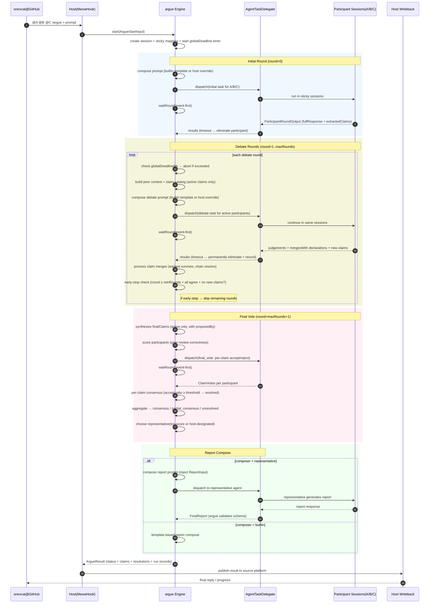

# argue v0 初期计划（单文档版）

> 本文件是 v0 唯一计划文档，包含流程、协议形状、等待机制与时序图。

## 0. 关键决策（当前版本）

1. 每个参与者默认固定同一会话（sticky-per-participant）。
2. 轮次输入优先传递他人上一轮**完整回答**（预算内，必要时截断）。
3. 输出采用 claim-level（逐论点）判断，而不是单条结论判断。
4. 引入评分系统，最终由最高分参与者代表发言。
5. 编排器负责等待机制（派发、等待、超时、补偿），不是宿主临时拼接。
6. 最终报告新增可选”过程揭露”模式；开启时建议走独立 reporter 会话生成。
7. “代表发言”与”报告生成方式（builtin/representative）”是两条独立维度。
8. 最低参与人数为 2（`minParticipants=2`）。
9. 支持 early-stop：跑满 `minRounds` 后，若所有参与者一致且无新议题，跳过剩余 debate 轮直接进入 `final_vote`。
10. 等待模式仅 `event-first`；超时参与者永久剔除并保留记录。
11. 共识判定在 claim 级别：每个 claim 按 `consensusThreshold` 独立投票判定，session 终态由 claim 判定结果聚合得出（`consensus` / `partial_consensus` / `unresolved`）。
12. Claim 支持显式合并（merge）：辩论过程中参与者可声明 claim 合并，先出现的 claim 存活。
13. argue 内置默认 prompt 模板（debate + report），host 可替换。
14. `ArgueResult` 包含 `requestId` 与完整 run records；JSONL run log 下沉到 M3 产品化阶段实现（host/CLI 可配）。

---

## 1. 目标与边界

### 目标

把“多 agent 并行产出 -> 多轮互评 -> 收敛共识 -> 代表发言 -> 可选过程揭露报告”做成可复用编排组件。

### 非目标（强约束）

`argue` 不负责：

1. 外部触发源接入（GitHub/IM/CLI 等）
2. 具体 agent 执行实现（OpenClaw hook / ACP / 本地 runtime）
3. 外部平台回写（GitHub 评论、消息发送等）

这些由宿主通过委托接口注入。

---

## 2. 核心流程（MVP）

1. **Start**：接收 `ArgueStartInput`，创建会话，启动 `globalDeadlineMs` 计时（如已配置）。
2. **Initial Round**：并行派发初始任务，收集完整回答与初始 claims。
3. **Debate Rounds**（`minRounds` ~ `maxRounds` 轮）：
   - 每个参与者在同一 sticky session 继续。
   - 带入他人上一轮完整回答（预算内）。
   - 输出 claim-level judgement（agree/disagree/revise），可声明 claim 合并（`mergesWith`）。
   - 超时参与者永久剔除，后续轮次不再派发；剔除记录保留在 session 中。
   - 引擎每轮结束处理 claim 合并：先出现的 claim 存活，链式合并递归解析。
   - **Early-stop 检查**（`round >= minRounds` 时）：所有活跃参与者一致 + 无新 claim / revise → 跳过剩余 debate 轮。
   - **globalDeadlineMs 检查**：超时则不开启新 round，以当前数据进入终态。
4. **Synthesis**：聚合成统一 `finalClaims`（含合并后状态）。
5. **Final Vote**：各参与者对**每个 active claim** 独立投票 `accept/reject`。
6. **Consensus**：每个 claim 按 `consensusThreshold` 判定（accept 比例 ≥ 阈值 → resolved）。session 终态：
   - 全部 resolved → `consensus`
   - 部分 resolved → `partial_consensus`
   - 全未通过 → `unresolved`
7. **Scoring**：按 rubric 计算分数，correctness 核心指标为 peer review（claims 被他人 agree 的比例）。
8. **Representative**：按分数选出代表。
9. **Report Compose**：
   - `builtin`：结构化模板快速生成
   - `representative`：argue 组织 prompt → 调用代表者 agent（得分最高或 host 指定）→ 校验返回的 `FinalReport`
10. **Finalize**：输出 `ArgueResult`，包含 `requestId`、完整 run records、per-claim 投票明细。

---

## 3. 协议形状

## 3.1 Start 输入：`ArgueStartInput`

```ts
export type ArgueStartInput = {
  requestId: string;
  task: string;

  participants: Array<{
    id: string; // e.g. onevclaw
    role?: string;
  }>;

  participantsPolicy?: {
    minParticipants?: number; // default: 2, must be >= 2
  };

  roundPolicy?: {
    minRounds?: number; // default: 2
    maxRounds?: number; // default: 3
  };

  sessionPolicy?: {
    mode: "sticky-per-participant"; // v0 固定
    sessionKeyPrefix?: string;
  };

  peerContextPolicy?: {
    passMode: "full-response-preferred";
    maxCharsPerPeerResponse?: number; // default: 6000
    maxPeersPerRound?: number; // default: all-others
    overflowStrategy?: "truncate-tail" | "truncate-middle";
  };

  scoringPolicy?: {
    enabled: true;
    representativeSelection: "top-score";
    tieBreaker: "latest-round-score" | "least-objection";
    rubric?: {
      correctness?: number;
      completeness?: number;
      actionability?: number;
      consistency?: number;
    };
  };

  consensusPolicy?: {
    threshold?: number; // 0~1, default: 1.0 (unanimous)
  };

  reportPolicy?: {
    includeDeliberationTrace?: boolean; // default: false
    traceLevel?: "compact" | "full"; // default: compact
    composer?: "builtin" | "representative"; // default: builtin
    representativeId?: string; // composer=representative 时可选，host 强制指定代表者
  };

  promptPolicy?: {
    debateTemplate?: string; // host 可替换 debate 轮 prompt 模板
    reportTemplate?: string; // host 可替换 report 轮 prompt 模板
  };

  waitingPolicy?: {
    perTaskTimeoutMs?: number; // default: 10m
    perRoundTimeoutMs?: number; // default: 20m
    globalDeadlineMs?: number; // 从 start() 计时，超时不开新 round，进入 unresolved
  };

  constraints?: {
    language?: string;
    tokenBudgetHint?: number;
  };

  context?: Record<string, unknown>; // 平台无关透传
};
```

## 3.2 轮次任务输入：`RoundTaskInput`

```ts
export type RoundTaskInput = {
  kind: "round";
  sessionId: string;
  requestId: string;
  participantId: string;
  phase: "initial" | "debate" | "final_vote";
  round: number;

  prompt: string;

  selfHistoryRef?: {
    stickySession: true;
  };

  peerRoundInputs?: Array<{
    participantId: string;
    round: number;
    fullResponse: string;
    truncated?: boolean;
  }>;

  claimCatalog?: Claim[];
  metadata?: Record<string, unknown>;
};
```

### 3.2.1 委托任务封装：`AgentTaskInput` / `AgentTaskResult`

```ts
export type ReportTaskInput = {
  kind: "report";
  sessionId: string; // 独立 report session
  requestId: string;
  participantId: string; // 可为活跃参与者，也可为 host 外部 reporter id
  prompt: string;
  reportInput: {
    status: "consensus" | "partial_consensus" | "unresolved" | "failed";
    representative: {
      participantId: string;
      speech: string;
      score: number;
    };
    finalClaims: Claim[];
    claimResolutions: ClaimResolution[];
    scoreboard: ParticipantScore[];
    rounds: Array<{ round: number; outputs: ParticipantRoundOutput[] }>;
  };
  metadata?: Record<string, unknown>;
};

export type AgentTaskInput = RoundTaskInput | ReportTaskInput;

export type AgentTaskResult =
  | { kind: "round"; output: ParticipantRoundOutput }
  | { kind: "report"; output: FinalReport };
```

## 3.3 论点与轮次输出

```ts
export type ClaimStatus = "active" | "merged" | "withdrawn";

export type Claim = {
  claimId: string;
  title: string;
  statement: string;
  category?: "pro" | "con" | "risk" | "tradeoff" | "todo";
  proposedBy: string[]; // participant IDs of original proposers
  status: ClaimStatus; // default: "active"
  mergedInto?: string; // claimId of the surviving claim (when status=merged)
};

export type ClaimJudgement = {
  claimId: string;
  stance: "agree" | "disagree" | "revise";
  confidence: number; // 0~1
  rationale: string;
  revisedStatement?: string;
  mergesWith?: string; // claimId — declare this claim is the same as another
};

export type ClaimVote = {
  claimId: string;
  vote: "accept" | "reject";
  reason?: string;
};

export type ParticipantRoundOutput = {
  participantId: string;
  phase: "initial" | "debate" | "final_vote";
  round: number;

  fullResponse: string;

  extractedClaims?: Claim[];
  judgements: ClaimJudgement[];

  claimVotes?: ClaimVote[]; // final_vote phase: per-claim accept/reject

  selfScore?: number;
  summary: string;
};
```

## 3.4 最终输出：`ArgueResult`

```ts
export type ParticipantScore = {
  participantId: string;
  total: number;
  byRound: Array<{ round: number; score: number }>;
  breakdown?: {
    correctness?: number;
    completeness?: number;
    actionability?: number;
    consistency?: number;
  };
};

export type OpinionShift = {
  claimId: string;
  participantId: string;
  from: "agree" | "disagree" | "revise" | "unknown";
  to: "agree" | "disagree" | "revise";
  round: number;
  reason?: string;
};

export type ClaimResolution = {
  claimId: string;
  status: "resolved" | "unresolved";
  acceptCount: number;
  rejectCount: number;
  totalVoters: number;
  votes: ClaimVote[];
};

export type FinalReport = {
  mode: "builtin" | "representative";
  traceIncluded: boolean;
  traceLevel: "compact" | "full";
  finalSummary: string;
  representativeSpeech: string;
  opinionShiftTimeline?: OpinionShift[];
  roundHighlights?: Array<{
    round: number;
    participantId: string;
    summary: string;
  }>;
};

export type EliminationRecord = {
  participantId: string;
  round: number;
  reason: "timeout" | "error";
  at: string; // ISO timestamp
};

export type ArgueResult = {
  requestId: string;
  sessionId: string;
  status: "consensus" | "partial_consensus" | "unresolved" | "failed";

  finalClaims: Claim[];
  claimResolutions: ClaimResolution[]; // per-claim voting results

  representative: {
    participantId: string;
    reason: "top-score" | "tie-breaker" | "host-designated";
    score: number;
    speech: string;
  };

  scoreboard: ParticipantScore[];
  eliminations: EliminationRecord[]; // participants removed during session

  report: FinalReport;

  disagreements?: Array<{
    claimId: string;
    participantId: string;
    reason: string;
  }>;

  rounds: Array<{
    round: number;
    outputs: ParticipantRoundOutput[];
  }>;

  metrics: {
    elapsedMs: number;
    totalRounds: number; // actual rounds run (may be < maxRounds due to early-stop)
    totalTurns: number;
    retries: number;
    waitTimeouts: number;
    earlyStopTriggered: boolean;
    globalDeadlineHit: boolean;
  };

  error?: { code: string; message: string };
};
```

---

## 4. 通讯接口与等待机制

## 4.1 委托接口

```ts
export interface AgentTaskDelegate {
  dispatch(task: AgentTaskInput): Promise<{
    taskId: string;
    participantId: string;
    kind: AgentTaskInput["kind"];
  }>;

  awaitResult(
    taskId: string,
    timeoutMs?: number
  ): Promise<{
    ok: boolean;
    output?: AgentTaskResult;
    error?: string;
  }>;

  cancel?(taskId: string): Promise<void>;
}

export interface ArgueObserver {
  onEvent(event: {
    sessionId: string;
    requestId: string;
    type:
      | "SessionStarted"
      | "RoundDispatched"
      | "ParticipantResponded"
      | "ParticipantEliminated"
      | "ClaimsMerged"
      | "RoundCompleted"
      | "EarlyStopTriggered"
      | "GlobalDeadlineHit"
      | "ConsensusDrafted"
      | "Finalized"
      | "Failed";
    at: string;
    payload?: Record<string, unknown>;
  }): Promise<void> | void;
}

export interface SessionStore {
  save(session: unknown): Promise<void>;
  load(sessionId: string): Promise<unknown | null>;
  update(sessionId: string, patch: unknown): Promise<void>;
}

export interface WaitCoordinator {
  waitRound(args: {
    round: number;
    taskIds: string[];
    policy: NonNullable<ArgueStartInput["waitingPolicy"]>;
  }): Promise<{
    completed: ParticipantRoundOutput[];
    timedOutTaskIds: string[];
    failedTaskIds: string[];
  }>;
}
```

## 4.2 waitRound 策略（v0）

1. 会话启动前校验参与人数：`participants.length >= minParticipants`，且 `minParticipants` 默认 2。
2. 每轮派发后必须进入 `waitRound`（event-first 模式，无其他模式）。
3. 到达 `perRoundTimeoutMs`：
   - 超时参与者**永久剔除**，后续轮次不再派发。
   - 剔除记录写入 session（`EliminationRecord`：participantId、round、reason、timestamp）。
   - 迟到结果直接丢弃（drop），不合并。
   - 剩余活跃参与者 >= `minParticipants`：继续。否则 `failed`。
4. `globalDeadlineMs`（可选）：从 `start()` 开始计时，超时后不开启新 round，以当前数据进入 `unresolved` 终态。

## 4.3 报告生成策略（v0）

1. `reportPolicy.composer=builtin`：引擎内部模板生成报告。
2. `reportPolicy.composer=representative`：argue 组织 prompt（注入 `ReportInput`），通过 `AgentTaskDelegate` 以 `kind=report` 派发到独立 report session。
   - `representativeId` 命中活跃参与者时，可用于指定代表者（`host-designated`）。
   - `representativeId` 也可作为外部 reporter id 交给 host 路由（不强制必须在活跃参与者内）。
3. representative 报告任务失败（dispatch / await / schema）时，回退到 builtin 报告，保证会话可完成。
4. 当 `includeDeliberationTrace=true` 且 `traceLevel=full`，推荐 `representative` 模式。

---

## 5. 共识、评分与报告规则（v0）

1. **共识判定在 claim 级别**：final vote 阶段每个参与者对每个 active claim 独立投票（accept/reject）。单个 claim 用**有效票分母**计算（`acceptCount / totalVoters`），比例 ≥ `consensusPolicy.threshold` → resolved。
2. **Session 终态聚合**：全部 claim resolved → `consensus`；部分 → `partial_consensus`；全未通过 → `unresolved`。`globalDeadlineMs` 超时也进入 `unresolved`。
3. **评分 rubric**：四维（correctness / completeness / actionability / consistency），host 可配权重。correctness 核心指标为 **peer review**：该参与者提出的 claims 被其他参与者 agree 的比例。
4. **Claim 合并**：辩论过程中参与者可通过 `ClaimJudgement.mergesWith` 声明合并。引擎每轮结束处理合并，先出现的 claim 存活，链式合并递归解析。被合并 claim 的 credit 归属所有共同提出者。
5. 最高分者作为代表（立场输出 + `representative` 模式下生成报告）。
6. 报告生成方式（builtin/representative）只影响呈现，不改变共识结果。
7. 平分时执行 tie-breaker。

---

## 6. 时序图（宿主以 GitHub + MeowHook 为例）

> GitHub 支持 Mermaid 代码块直接渲染。



---

## 7. 集成边界（再次强调）

`argue` 仅提供：

- 状态机与轮次编排
- 协议定义
- 等待与超时控制
- 评分与代表发言选择
- 报告生成流程编排（含可选委托）

宿主负责：

- 外部触发源
- 具体 agent 调用
- 外部结果回写

---

## 8. 目录建议

```text
argue/
  src/
    core/
      engine.ts
      state-machine.ts
      consensus-delphi.ts
      scoring.ts
      wait-coordinator.ts
      report-compose.ts
    contracts/
      request.ts
      task.ts
      result.ts
      delegate.ts
      events.ts
    store/
      memory-store.ts
    index.ts
  docs/
    plan/
      v0-initial.md
```

---

## 9. MVP 里程碑

### M1（先跑通）✅

- 至少 2 参与者（默认示例 3）
- initial + 固定轮数 debate + final vote
- sticky-per-participant session
- claim-level judgement
- event-first waitRound + timeout
- builtin 报告生成
- 启发式评分（4 维 rubric）

### M2（可集成）✅

- **Early-stop**：`minRounds` 后检测共识信号，提前结束 debate
- **参与者剔除**：超时/错误永久剔除 + `EliminationRecord` 追踪；迟到结果 drop
- **`globalDeadlineMs`**：session 级总时限，超时进入 `unresolved`
- **Claim 合并**：显式 `mergesWith` 机制，先出现者存活，链式解析；`Claim` 含 `proposedBy` / `status` / `mergedInto`
- **Claim 级共识**：final vote 为 per-claim 投票，按**有效票分母**判定；session 终态：`consensus` / `partial_consensus` / `unresolved`
- **评分改进**：correctness 核心指标改为 peer review（claims 被他人 agree 的比例）
- **统一委托协议**：`AgentTaskDelegate` 升级为 `kind=round|report`（`round` 内含 `phase`）
- **Representative 报告模式**：argue 组织 prompt → 调用代表者/外部 reporter → 校验 `FinalReport`，失败回退 builtin
- **Prompt 模板**：argue 内置默认 debate + report prompt 模板，host 可替换
- **Schema 清理**：移除 `waitingPolicy.mode`、`lateArrivalPolicy`、`maxReportChars`

### M3（可验证产品）🎯

目标：不是只做“可集成引擎”，而是做一个可以在本地直接跑通的最小产品闭环。

CLI 专项计划文档：`docs/plan/cli-v0.md`

#### M3 目标定义（最小可验证）

1. 提供 `argue` 命令行工具（host）
2. 通过配置文件声明参与者与运行时（Claude CLI / Codex CLI / SDK adapter）
3. 运行一次真实多 agent 辩论并输出可读结果（终端 + JSON 文件）
4. 提供可重复的 e2e 验证用例（含异常路径）

#### 当前缺口（相对 M3）

- 缺少独立 host/CLI 包（目前只有 engine library）
- 缺少 runtime adapter 抽象与实现（CLI 进程调用 / SDK 调用）
- 缺少 agent profile 配置与校验（model、命令模板、超时、并发限制）
- 缺少产品级 run artifact 输出（JSONL 事件日志、最终报告文件、失败快照）
- 缺少“真实 host + 假代理/真代理”混合 e2e 测试矩阵

#### 建议实现路径（M3）

- **M3-A Host Skeleton**
  - 新增 `packages/argue-cli`（或 `apps/argue-cli`）
  - 命令：`argue run --config ./argue.config.{json|yaml}`
  - 最小输出：stdout 摘要 + `./out/<requestId>.result.json`

- **M3-B Runtime Adapters**
  - `claude-cli` adapter（如 `claude -p`）
  - `codex-cli` adapter（如 `codex exec`）
  - `mock` adapter（稳定回放，供 CI 与 edge case 验证）
  - 统一映射到 `AgentTaskDelegate`（`kind=round|report`）

- **M3-C Product Validation**
  - 固定 demo config（3 agents）+ 一键脚本
  - 覆盖成功、缺席超时、merge、振荡分歧、report fallback
  - 输出 JSONL run log（M3 交付项）

- **M3-D 可用性打磨（可并行）**
  - 更好的终端展示（round 进度、淘汰提示、claim resolution 汇总）
  - 失败恢复与重试策略（host 侧）
  - 文档：Quick Start（5 分钟跑起来）
